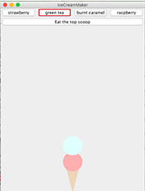

# Ice Cream Shop

Ice Cream Shop is a game that allows users to design their own ice cream, "eat" the ice cream and serve ice cream orders in a virtual shop. [IceCreamMakerApplication.java](https://github.com/vantrinh7/IceCreamShop/blob/master/src/IceCreamMakerApplication.java) creates a simple version of the game, where user can put a flavored scoup of ice cream upon an ice cream cone. There are four flavors: strawberry, green tea, burnt caramel and raspberry. 

     

