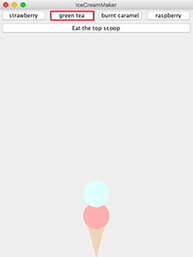

# Ice Cream Shop

Ice Cream Shop is a game that allows users to design their own ice cream, "eat" the ice cream and serve ice cream orders in a virtual shop. [IceCreamMakerApplication.java](https://github.com/vantrinh7/IceCreamShop/blob/master/src/IceCreamMakerApplication.java) creates a simple version of the game, where user can put a flavored scoup of ice cream upon an ice cream cone. There are four flavors: strawberry, green tea, burnt caramel and raspberry. When clicking on "Eat the top scoup" button, the top scoup will be removed, or "eaten".

 

 

[IceCreamManagerApplication.java](https://github.com/vantrinh7/IceCreamShop/blob/master/src/IceCreamManagerApplication.java) creates a game in which user prepares ice cream according to a list of orders (left column) and serves the ice cream as fast as possible. When "Start" button is clicked, a timer starts counting down. 

 

  

User designs ice cream according to the given orders. Each correct serving earns 10 points, and each incorrect serving looses 5 points. 

 

  

 

