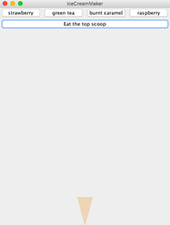
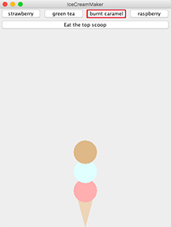

# Ice Cream Shop

Ice Cream Shop is a game that allows users to design their own ice cream, consume the ice cream, and serve ice cream orders in a virtual shop. In the game, user prepares ice cream according to a list of orders and serves the ice cream as fast as possible. 

First, add any of the four flavors using "Strawberry", "Green tea", "Burnt caramel" and "Raspberry" buttons. When clicking on "Eat the top scoop" button, the top scoop will be removed.

 

 

When "Start" button is clicked, a timer starts counting down. User designs the ice cream according to the given orders (left column) and click "Serve the next order". Each correct serving earns 10 points, and each incorrect serving looses 5 points. 

 

  

 

  

 
This program creates a Linked List structure from scratch, which is used to create Stack and Queue data structures. A Stack (last in first out) is used to determine which ice cream scoup is eaten, and a Queue (first in first out) is used to determine which ice cream order is served.

## File Description
* [LinkedListNode.java](https://github.com/vantrinh7/IceCreamShop/blob/master/src/LinkedListNode.java) defines the a node in the linked list and provides getter and setter methods of the nodes.
* [LinkedList/java](https://github.com/vantrinh7/IceCreamShop/blob/master/src/LinkedList.java) creates the main functions of a linkedlist, such as insertion, deletion, lookup and `toString()` methods.
* [Stack.java](https://github.com/vantrinh7/IceCreamShop/blob/master/src/Stack.java) is an interface that encapsulates the ADT for a stack data structure. 
* [StackLL.java](https://github.com/vantrinh7/IceCreamShop/blob/master/src/StackLL.java) is a linked list that implements the Stack interface, defines Stack functions such as `push()` (add element), `pop()`(remove element), `peek()` (get data at the top) and check if a stack is empty.
* [Queue.java](https://github.com/vantrinh7/IceCreamShop/blob/master/src/Queue.java) is an interface that encapsulates the ADT for a queue data structure. 
* [QueueLL.java](https://github.com/vantrinh7/IceCreamShop/blob/master/src/QueueLL.java) is a linked list that implements the Queue interface, defines Queue functions such as `enqueue()` (add element), `dequeue()`(remove element), `peek()` (get data at the top) and check if a stack is empty.
* [IceCreamCone.java](https://github.com/vantrinh7/IceCreamShop/blob/master/src/IceCreamCone.java) defines a scoop on the cone and provides methods to find the flavor index, add the scoop and remove the scoop. It uses a Stack structure to keep track of the scoops: last scoop in is the first scoop out. The class serves as the Model component in Model-View-Controller.
* [IceCreamConeView.java](https://github.com/vantrinh7/IceCreamShop/blob/master/src/IceCreamConeView.java) paints the cone and scoop of an ice cream cone. The class serves as the View component in Model-View-Controller.
* [IceCreamMaker.java](https://github.com/vantrinh7/IceCreamShop/blob/master/src/IceCreamMaker.java) is a JPanel that creates menu and buttons. It listens to events from the buttons and acts accordingly. This class serves as the Controller component in Model-View-Controller.
* [IceCreamMakerApplication.java](https://github.com/vantrinh7/IceCreamShop/blob/master/src/IceCreamMakerApplication.java) has the `main()` method that runs the program. It creates a frame and calls [IceCreamMaker.java](https://github.com/vantrinh7/IceCreamShop/blob/master/src/IceCreamMaker.java).
* [IceCreamLine.java](https://github.com/vantrinh7/IceCreamShop/blob/master/src/IceCreamLine.java) defines an ice cream order line and specifies the functions to add, look up and check orders. It uses a Queue structure to keep track of the orders: first order in is the first order out. The class serves as the Model component in Model-View-Controller.
* [IceCreamLineManager.java](https://github.com/vantrinh7/IceCreamShop/blob/master/src/IceCreamLineManager.java) is a JPanel that creates menu and buttons. It listens to events from the buttons and acts accordingly. This class serves as the Controller component in Model-View-Controller.
* [IceCreamManagerApplication.java](https://github.com/vantrinh7/IceCreamShop/blob/master/src/IceCreamManagerApplication.java) has the `main()` method that runs the program. It creates a frame and calls [IceCreamLineManager.java](https://github.com/vantrinh7/IceCreamShop/blob/master/src/IceCreamLineManager.java).
* [IceCreamShop.java](https://github.com/vantrinh7/IceCreamShop/blob/master/src/IceCreamShop.java) defines the ice cream shop game, specifies the game logic, and handles menus, buttons and action events. The class serves as the Model and Controller components in Model-View-Controller.
* [TimeIceCreamShop.java](https://github.com/vantrinh7/IceCreamShop/blob/master/src/TimedIceCreamShop.java) extends IceCreamShop.java and handles the timing of the game. The class serves as the Model and Controller components in Model-View-Controller.
* [IceCreamShopApplication.java](https://github.com/vantrinh7/IceCreamShop/blob/master/src/IceCreamShopApplication.java) has the `main()` method that runs the program. It creates a frame and calls [TimedIceCreamShop.java]((https://github.com/vantrinh7/IceCreamShop/blob/master/src/TimedIceCreamShop.java).

